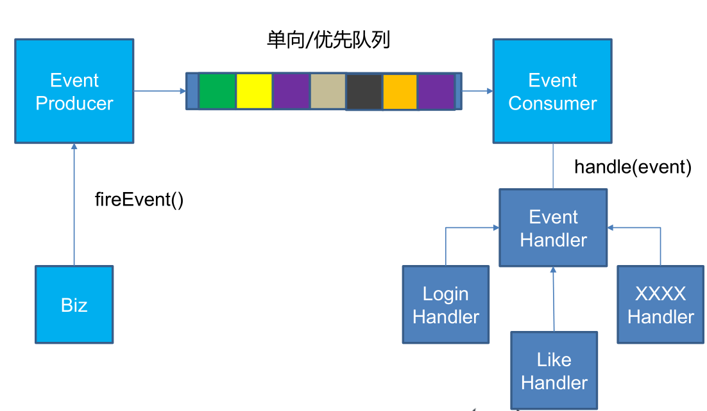

# wenda
一个基于SSM的问答社区网站
## 一.项目的来源

## 二.项目的亮点

+ ### 异步队列

异步队列是使用redis的list来实现的。将需要延后处理的任务结构体序列化成字符串塞进redis的列表，另一个线程从这个列表中轮询数据进行处理。

    producer中的fireEvent方法，将事件发生的现场序列化以后塞进列表中:
    
    public boolean fireEvent(EventModel eventModel){
        try{
            String json = JSONObject.toJSONString(eventModel);
            String key = RedisKeyUtil.getEventQueueKey();
            jedisAdapter.lpush(key,json);
            return true;
        }catch (Exception e){
            return false;
        }
    }
    
    当Spring启动的时候，会加载一个consumer线程，它不断地从列表中取出待处理的事件，如果列表中没有要处理的事件，则consumer一直阻塞
    
    //开启一个线程，不断地取出事件
        Thread thread = new Thread(new Runnable(){
            @Override
            public void run() {
                while(true){
                    String key = RedisKeyUtil.getEventQueueKey();
                    //从队列中取出事件
                    List<String> events = jedisAdapter.brpop(0,key);

                        for(String message:events){
                        if(message.equals(key)){
                            continue;
                        }
                        //反序列化
                        EventModel eventModel = JSON.parseObject(message,EventModel.class);
                        if(!config.containsKey(eventModel.getType())){
                            logger.error("不能识别的事件");
                            continue;
                        }

                        for(EventHandler handler:config.get(eventModel.getType())){
                            handler.doHandle(eventModel);
                        }
                    }
                }
            }
        });

        thread.start();
        
每一个事件都对应着一个处理该事件的handler。consumer从队列中取出一个事件后只需要让其对应的handler去处理这个事件就可以了。以下是handler接口的定义

    public interface EventHandler {

    void doHandle(EventModel model);

    List<EventType> getSupportEventTypes();
}

+ ### redis的应用

在该网站中，主要使用redis实现了以下功能:
1.点赞/踩
用户的点赞数据是存储在redis缓存中的，维护两个set,一个like，一个dislike。当用户点赞的时候，先将redis中set的点赞信息更新，然后异步实现发送站内信的功能。producer会将一个点赞事件放到异步队列中，consumer取出后将其交给likehandler处理，由likehandler来发送站内信。

    public String like(@RequestParam("commentId") int commentId){
        if(hostHolder.getUser() == null){
            return WendaUtil.getJSONString(999);
        }
        Comment comment = commentService.getCommentById(commentId);

        eventProducer.fireEvent(new EventModel(EventType.LIKE)
                .setActorId(hostHolder.getUser().getId())
                .setEntityId(commentId)
                .setEntityType(EntityType.ENTITY_COMMENT)
                .setEntityOwnerId(comment.getUserId()).setExt("questionId",String.valueOf(comment.getEntityId())));
        long likeCount = likeService.Like(hostHolder.getUser().getId(),EntityType.ENTITY_COMMENT,commentId);
        return WendaUtil.getJSONString(0,String.valueOf(likeCount));
    }

## 项目遇到的问题
