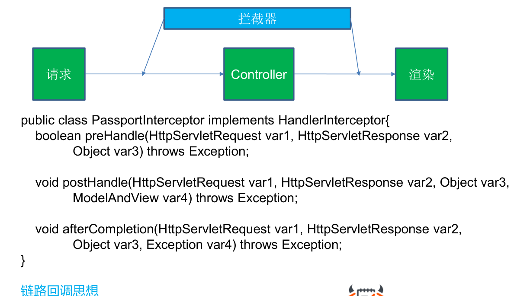
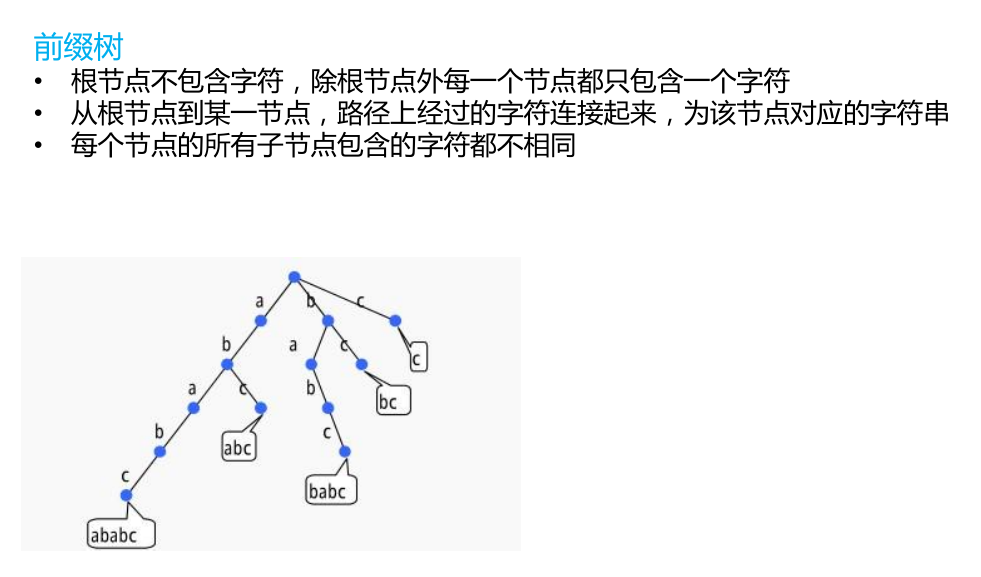
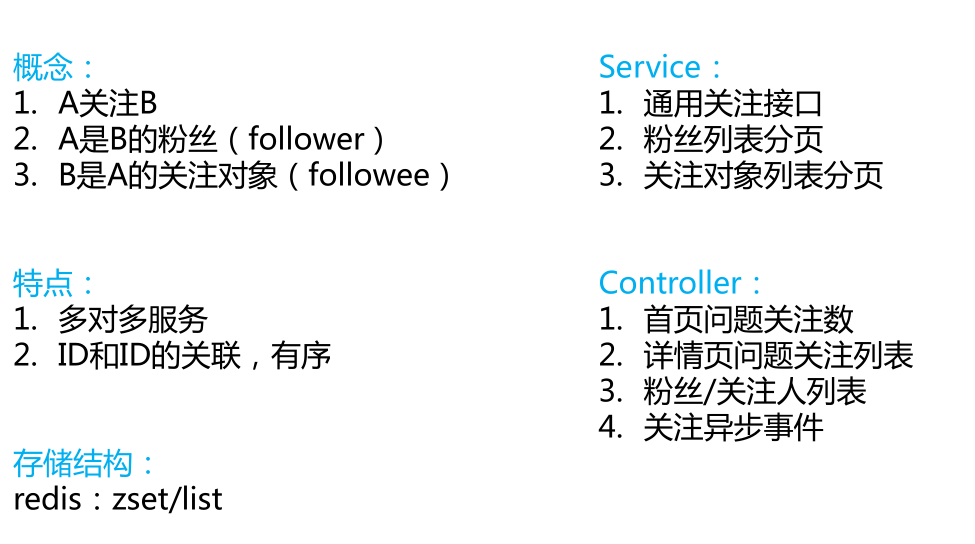

# wenda
一个基于SSM的问答社区网站
## 一.项目的来源

## 二.项目环境搭建

## 三.项目的主要功能

+ ### 和前台的交互

+ ### 登录ticket

每次当用户登录/注册的时候都会下发一个cookie,cookie中包含了一张表明用户身份的ticket。

#### 什么是cookie?

cookie是当你浏览某个网站的时候，由web服务器存储在你的机器硬盘上的一个小的文本文件。它其中记录了你的用户名、密码、浏览的网页、停留的时间等等信息。当你再次来到这个网站时，web服务器会先看看有没有它上次留下来的cookie。如果有的话，会读取cookie中的内容，来判断使用者，并送出相应的网页内容，比如在页面显示欢迎你的标语，或者让你不用输入ID、密码就直接登录等等。

当客户端要发送http请求时，浏览器会先检查下是否有对应的cookie。有的话，则自动地添加在request header中的cookie字段。注意，每一次的http请求时，如果有cookie，浏览器都会自动带上cookie发送给服务端。那么把什么数据放到cookie中就很重要了，因为很多数据并不是每次请求都需要发给服务端，毕竟会增加网络开销，浪费带宽。所以对于那设置“每次请求都要携带的信息（最典型的就是身份认证信息）”就特别适合放在cookie中，其他类型的数据就不适合了。

+ ### 拦截器的使用

拦截器是基于一种链路回调的思想，在框架中留下一个口子，让后面的业务有地方可以插进来

我们只需要自定义三个回调函数：

preHandler: 处理每个请求之前都需要回调一下，可以用来做身份验证。

postHandler: 在渲染页面之前回调。

afterCompletion：所有的事情都做完了回调一下。

    //使用拦截器从Cookie中读取用户的登录信息
    public boolean preHandle(HttpServletRequest httpServletRequest, HttpServletResponse httpServletResponse, Object o) throws Exception {
        String ticket = null;
        if(httpServletRequest.getCookies() != null){
            for(Cookie cookie:httpServletRequest.getCookies()){
                if(cookie.getName().equals("ticket")){
                    ticket = cookie.getValue();
                    break;
                }
            }
        }

        if(ticket != null){
            LoginTicket loginTicket = loginTicketDao.selectByTicket(ticket);
            if(loginTicket == null || loginTicket.getExpired().before(new Date()) || loginTicket.getStatus() == 1){
                return true;
            }
            User user = userDao.selectByID(loginTicket.getUserId());
            hostHolder.setUsers(user);
        }
        return true;
    }

+ ### ThreadLocal的使用

首先要理解一下为什么需要需要ThreadLocal

每次用户发送一个请求过来，preHandler都会从cookie中获取一下用户的登录情况，将用户的登录信息放在一个变量中，方便后面的业务读取。

而这件事情，我们想通过IOC来实现，让Spring帮我们把包含这个变量信息的类实例化好并注入到代码当中。而在Spring中，有以下两点需要注意：

(1) web容器本身就是多线程的，每一个HTTP请求都会产生一个独立的线程（或者从线程池中取得创建好的线程）；
(2) Spring中的bean（用@Repository、@Service、@Component和@Controller注册的bean）都是单例的，即整个程序、所有线程共享一个实例；
在

因此如果用一个普通的User user变量来存放用户信息，那么当两个线程同时访问的时候，User就只能存放一个用户的信息，这样就会造成用户信息的泄漏。

使用LocalThread，可以让每一条线程都拥有一个属于自己的变量。

    //为每一个线程都保存了一个本地的User变量
    private static ThreadLocal<User> users = new ThreadLocal<User>();

+ ### 前缀树敏感词过滤

+ ### 异步框架

异步队列是使用redis的list来实现的。将需要延后处理的任务结构体序列化成字符串塞进redis的列表，另一个线程从这个列表中轮询数据进行处理。

    producer中的fireEvent方法，将事件发生的现场序列化以后塞进列表中:
    
    public boolean fireEvent(EventModel eventModel){
        try{
            String json = JSONObject.toJSONString(eventModel);
            String key = RedisKeyUtil.getEventQueueKey();
            jedisAdapter.lpush(key,json);
            return true;
        }catch (Exception e){
            return false;
        }
    }
    
    当Spring启动的时候，会加载一个consumer线程，它不断地从列表中取出待处理的事件，如果列表中没有要处理的事件，则consumer一直阻塞
    
    //开启一个线程，不断地取出事件
        Thread thread = new Thread(new Runnable(){
            @Override
            public void run() {
                while(true){
                    String key = RedisKeyUtil.getEventQueueKey();
                    //从队列中取出事件
                    List<String> events = jedisAdapter.brpop(0,key);

                        for(String message:events){
                        if(message.equals(key)){
                            continue;
                        }
                        //反序列化
                        EventModel eventModel = JSON.parseObject(message,EventModel.class);
                        if(!config.containsKey(eventModel.getType())){
                            logger.error("不能识别的事件");
                            continue;
                        }

                        for(EventHandler handler:config.get(eventModel.getType())){
                            handler.doHandle(eventModel);
                        }
                    }
                }
            }
        });

        thread.start();
        
每一个事件都对应着一个处理该事件的handler。consumer从队列中取出一个事件后只需要让其对应的handler去处理这个事件就可以了。以下是handler接口的定义

    public interface EventHandler {

    void doHandle(EventModel model);

    List<EventType> getSupportEventTypes();
}

+ ### redis的应用

在该网站中，主要使用redis实现了以下功能:
1.点赞/踩
用户的点赞数据是存储在redis缓存中的，维护两个set,一个like，一个dislike。当用户点赞的时候，先将redis中set的点赞信息更新，然后异步实现发送站内信的功能。producer会将一个点赞事件放到异步队列中，consumer取出后将其交给likehandler处理，由likehandler来发送站内信。

    public String like(@RequestParam("commentId") int commentId){
        if(hostHolder.getUser() == null){
            return WendaUtil.getJSONString(999);
        }
        Comment comment = commentService.getCommentById(commentId);

        eventProducer.fireEvent(new EventModel(EventType.LIKE)
                .setActorId(hostHolder.getUser().getId())
                .setEntityId(commentId)
                .setEntityType(EntityType.ENTITY_COMMENT)
                .setEntityOwnerId(comment.getUserId()).setExt("questionId",String.valueOf(comment.getEntityId())));
        long likeCount = likeService.Like(hostHolder.getUser().getId(),EntityType.ENTITY_COMMENT,commentId);
        return WendaUtil.getJSONString(0,String.valueOf(likeCount));
    }

2. TimeLine

两种不同的获取模式，对那些比较活跃的用户，可以将他们的Feed写入redis缓存队列。

对那些不活跃的用户，要获取Feeds，就要直接从数据库中读取。以下是两种模式的实现：

    @RequestMapping(path={"/pushfeeds"},method = {RequestMethod.GET, RequestMethod.POST})
    public String getPushFeeds(Model model){
        int localUserId = hostHolder.getUser() != null ? hostHolder.getUser().getId() : 0;
        List<String> feedIds = jedisAdapter.lrange(RedisKeyUtil.getTimelineKey(localUserId),0,10);
        List<Feed> feeds = new ArrayList<>();
        for(String feedId:feedIds){
            Feed feed = feedService.getById(Integer.parseInt(feedId));
            if(feed != null) {
                feeds.add(feed);
            }
        }
        model.addAttribute("feeds",feeds);
        return "feeds";
    }

    @RequestMapping(path={"/pullfeeds"},method = {RequestMethod.GET,RequestMethod.POST})
    private String getPullFeeds(Model model){
        int localUserId = hostHolder.getUser() != null ? hostHolder.getUser().getId() : 0;
        List<Integer> followees = new ArrayList<>();
        if(localUserId != 0){
            //获取我所有关注的人
            followees = followService.getFollowees(EntityType.ENTITY_USER,localUserId,Integer.MAX_VALUE);
        }
        List<Feed> feeds = feedService.getUserFeeds(Integer.MAX_VALUE,followees,10);
        model.addAttribute("feeds",feeds);
        return "feeds";
    }

+ ### 关注用户/粉丝

+ ### 全文搜索引擎solr

Solr是一个高性能，采用Java5开发，基于Lucene的全文搜索服务器。用户可以通过http请求，向搜索引擎服务器提交一定格式的XML文件，生成索引；也可以通过Http Get操作提出查找请求，并得到XML格式的返回结果。

[solr的机制总结](https://zhuanlan.zhihu.com/p/38115659)

solr原装使用引文的分词器，所以我们要自己引入一个中文的分词器 IK-Analyzer

中文分词:IK-Analyzer:

     <!--建索引的时候使用细粒度分词-->
     <fieldType name="text_ik" class="solr.TextField">
        <!--索引的分词器-->
        <analyzer type="index">
          <tokenizer class="org.wltea.analyzer.util.IKTokenizerFactory" useSmart="false"/>
          <filter class="solr.LowerCaseFilterFactory"/>
        </analyzer>
        <!--查询的分词器-->
        <analyzer type="query">
          <tokenizer class="org.wltea.analyzer.util.IKTokenizerFactory" useSmart="true"/>
        </analyzer>
    </fieldType>

## 项目遇到的问题
